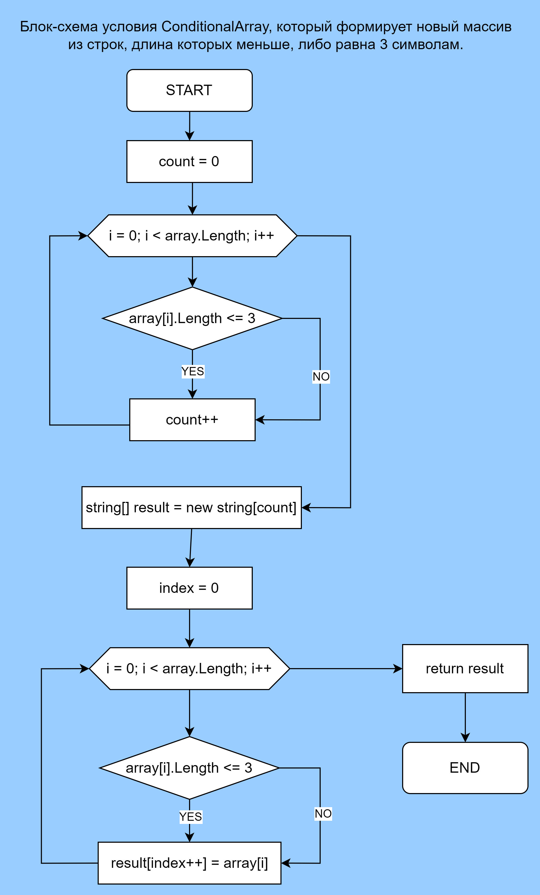

# Итоговое задание по С#
## Задача:
### Написать программу, которая из имеющегося массива строк формирует новый массив из строк, длина которых меньше, либо равна 3 символам. Первоначальный массив можно ввести с клавиатуры, либо задать на старте выполнения алгоритма. При решении не рекомендуется пользоваться коллекциями, лучше обойтись исключительно массивами.

## Примеры:

[“Hello”, “2”, “world”, “:-)”] → [“2”, “:-)”]

[“1234”, “1567”, “-2”, “computer science”] → [“-2”]

[“Russia”, “Denmark”, “Kazan”] → []

## Алгоритм программы:
1. Функция TakeEnteredNumber (ПринятьВведенноеЧисло):

Эта функция принимает сообщение в виде строки (message), выводит его на консоль и ожидает ввода пользователя.
Введенная строка преобразуется в целое число (int) с помощью Convert.ToInt32.
Функция возвращает введенное пользователем число.

2. Инициализация переменной userArray (МассивПользователя):

Создается переменная userArray, которая содержит количество элементов массива и получается с помощью вызова функции TakeEnteredNumber.

3. Функция GetUserArray (ПолучитьМассивПользователя):

Эта функция заполняет массив строк (string[] userArray) данными, введенными пользователем.
Используется цикл for, чтобы запросить у пользователя каждый элемент массива, и затем введенные значения сохраняются в соответствующих ячейках массива.

4. Функция PrintArray (ВывестиМассив):

Эта функция выводит содержимое массива строк на консоль.
Используется цикл for для перебора элементов массива, и каждый элемент выводится на консоль. После каждого элемента выводится запятая и пробел, за исключением последнего элемента.

5. Инициализация и заполнение массива stringArray:

Создается массив строк (stringArray) с заранее определенным размером (количество элементов введено пользователем).
Функция GetUserArray заполняет этот массив данными, введенными пользователем.

6. Функция ConditionalArray (УсловныйМассив):

Эта функция принимает массив строк и возвращает новый массив, содержащий только те строки, длина которых не превышает 3 символа.
Сначала подсчитывается количество подходящих строк в исходном массиве.
Затем создается новый массив нужного размера, и в него копируются подходящие строки.

7. Вывод stringArray на консоль:

Функция PrintArray используется для вывода содержимого массива stringArray на консоль.

8. Вывод отфильтрованного массива на консоль:

Функция PrintArray также используется для вывода содержимого массива, полученного после применения функции ConditionalArray к stringArray. В этом массиве содержатся только строки, удовлетворяющие условию (длина не более 3 символов).

## Блок-схема функции ConditionalArray

